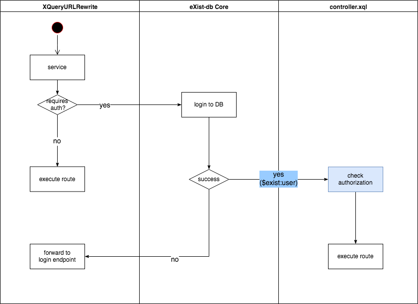

# Descriptive authentication for eXist-db apps

From a users perspective eXist-db applications have been one of the major additions to the
platform in the last years. They transformed eXist-db from a database into a complete application platform.

An eXist-db application packages HTML, XQuery modules, resources (JavaScript, CSS, images + fonts) and an controller all in one single zipped archive. With the help of some metadata found in expath-pkg.xml and repo.xml eXist-db knows how to install or update those without further interaction of the user.

One of the most important parts of an eXist-db application is the controller (controller.xql). It serves the purpose of mapping incoming URLs to internal resources very similar to what web.xml does for the J2EE world.

However to achieve authentication the developer of an app has to include the login module which authenticates the user against the database to allow access to protected resources.

Further the developer has to make sure that a login page is presented if the user is not logged in already. All URL patterns that shall be protected need an explicit call to login:set-user function to trigger the login to the database. The result of that operation must then be checked and either forward to the requested URL (if logged in) or forward to a login page.

All in all a lot of room for mistakes. During my own efforts in building applications i struggled with this rather basic task over and over again eating up time that i should have spent on implementing features for the customer. While setting up a proper authentication should be a matter of minutes i ended up spending whole days until i got it working cleanly. Clearly a candidate for improvement.

Another consequence of this current architecture is the fact that the controller.xql must always be public readable and executable. This certainly shouldn't be the case for apps where you require an authenticated login for all functionalities.

## The current approach

To illustrate the problem and its proposed solution we first have a high-level look at the current approach.


The control flow is as follows:

1. a request reaches XQueryURLRewrite servlet. This is configured to handle all incoming requests
2. in the 'service' method a default (unpriviledged) guest user is created
3. the controller will be configured and executed with that guest user
4. if the request matches a protected resource the controller must call login:set-user which will execute the actual login to the database.  In case of success this will return an privileged user. If the login fails for some reason the controller must forward the request to the login page.
5. excecution of the actual request takes place

Problem: the developer is fully responsible to handle the whole process starting from 4.

## The new approach

The new approach is based on the idea that the developer shouldn't be responsible for handling the actual authentication procedure. Instead the XQueryURLRewrite already handles this before the controller is called. As a result of successful authentication the variable 'exist:user' will be made available in controller.xql to allow for further authorization.

The following diagram shows the new control flow:



Please note the exchanged columns for eXist-db Core and controller.xql.

The new approach changes the flow to:

1. a request reaches XQueryURLRewrite servlet. This is configured to handle all incoming requests
2. the new AppAuthenticator will check if the requested resource is protected (see below)
3. if yes a database login is attempted. In case of success the username will be passed to the controller as an external variable called $exist:user. This may then be used to check authorization for the given user. In case of failure the request is sent to the login procedure.

As a consequence the developer does not need to worry about authentication any more but can rely on the fact that an $exist:user will always be set. Authorization however is always application-specific and must be handled within the controller. But with the user always been given as var it is now easy to use the common XQuery function to e.g. check for a certain user group.

## Setup the authentication

Some additional markup in repo.xml enables the developer to setup authentication. Here's an example

```
<authentication>
        <token lifetime="300" separator="|" alg="HmacSHA256" cookie-name="RepoAuth"/>
        <mechanism name="builtin">
            <login-endpoint>login.html</login-endpoint>
            <logout-endpoint>index.html?logout=true</logout-endpoint>
            <login-fail>login.html?failed=true</login-fail>
        </mechanism>
        <!-- ### alternative mechanism ###
        <mechanism name="SAML">
             SAML specific config markup
        </mechanism>
        -->
        <allowed>
            <uri>resources/</uri>
            <uri>bower_components/</uri>
            <uri>index.html</uri>
        </allowed>
    </authentication>
```

For most elements here there will be defaults when the respective element is not present. The new approach uses a whitelist approach - only URLs that are listed under ```<allowed>``` are passed along without authentication. For each URL that is not present there the login endpoint will be called to either present a login form or use other means to login the user. As the mechanism endpoints must be publicly available these are added to the whitelist automatically.

The default mechanism is a simple login.html form but others can be plugged (see commented entry for SAML).

## State of implementation

The implementation is still in a proof-of-concept state and not publicly available in the eXist-db codebase. The first release will also only provide the 'builtin' mechanism which uses a login form. However this is a very common case for eXist-db apps and should be sufficient to confirm the usefulness of the new approach.
Once the concept has been approved it is planned to add more mechanisms such as SAML.

## Compatibility

The new mechanism is opt-in and fully backward compatible with existing applications that may continue to use the old login module.

That means that only if you provide an ```<authentication>``` element in repo.xml the AppAuthenticator will be executed - if that element is not present the app will be processed just as before.

## Current limitations

The current design builds on the following assumptions:

1. the majority of apps is using a login form
1. a single authorisation token for all apps is sufficient


### Default login mechanism

The default mechanism which we implemented for AppAuthenticator is 'builtin' which means to use a login.html file for authenticating users (which of course should be protected by a SSL connection). We assume that this covers the big majority of eXist-db apps and therefore was chosen as first target. But of course the idea is to support several mechanisms here and SAML will be next to be pluggable here.

### Single sign-on

It's still a bit of an open questions if this is a limitation or a feature.

The current implementation authenticates users by setting a token which identifies the user against the database. This token is valid for all applications which means: if you're authenticated for one app you're authenticated for all others. When logging out of one app you'll be logged out for all apps.

While we're aware that there's a concept of app domains we actually couldn't think of a use case where this will be needed - in the current implementation a user is authenticated once however it is a different question which actual rights for certain resources apply. This should be handled on the authorization level (controller.xql) by checking membership in certain groups.
